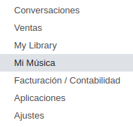
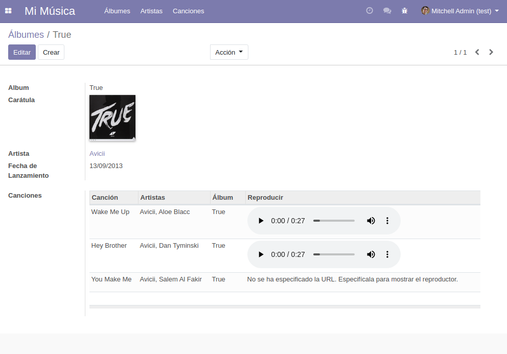
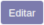
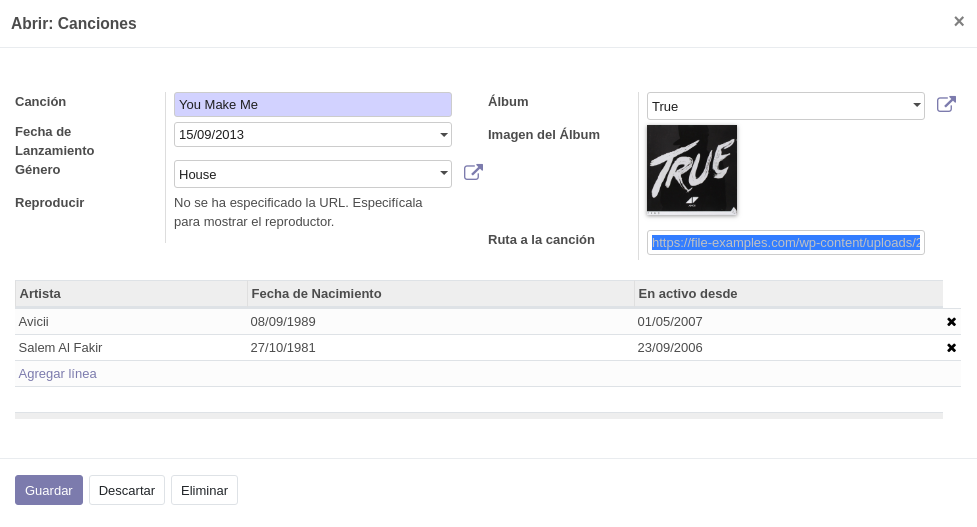
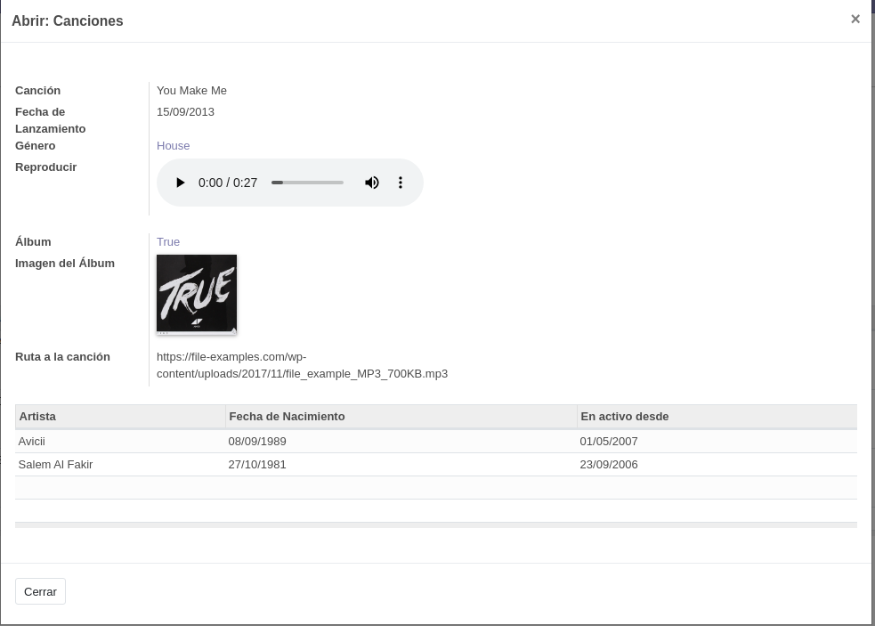
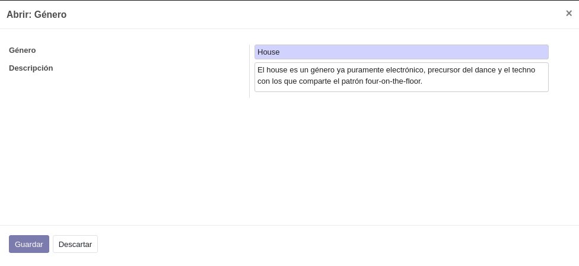
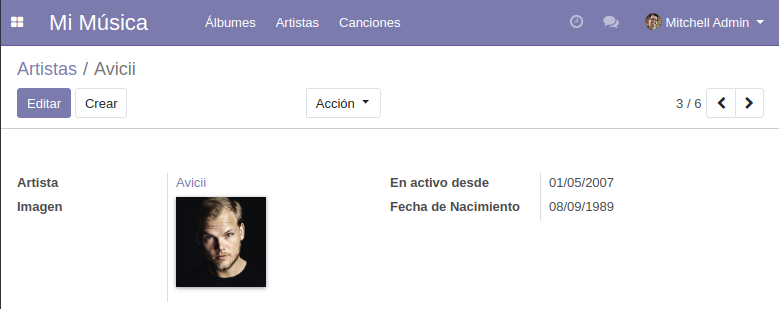
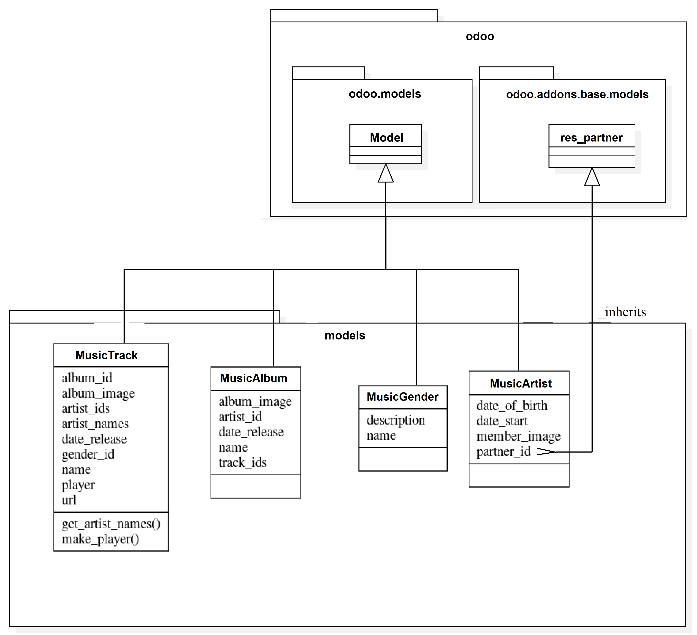

# Mi Música

__Mi Música__ es un módulo que proporciona una forma fácil y sencilla de gestionar entidades musicales en un servidor Odoo.

## _Funcionalidades_

+ Gestión de canciones, así como de artistas, álbumes y géneros musicales. 

+ Añadir metadatos como carátulas de álbum o fechas de lanzamiento. 

+ Integración con reproductores HTML para audio MP3 en base a la URL del fichero.

## _Objetivos_

+ Ofrecer un acceso limpio y claro a la información relativa a estas entidades musicales.

+ Permitir añadir, modificar y eliminar registros al usuario.

## _Interfaz y uso_

Una vez instalado el módulo, se añadirá un elemento "Mi Música" al menú principal de Odoo:

Haciendo click en ese elemento, accederemos a la vista __Tree/List__ de los álbumes de forma predeterminada, donde desde cada uno de los elementos del submenú propio del módulo, podremos desplazarnos a las vistas de las otras entidades:

Al acceder a algún registro, se abrirá la vista __Form__ correspondiente, en este caso se muestra la relativa a los álbumes, que está conformada por la información propia del álbum así como del enlace al artista que lanzó y una vista __Tree/List__ de las canciones que lo componen:

En este ejemplo, como se puede ver, hay dos canciones que se pueden reproducir pero hay una que no tiene un fichero de audio MP3 asociado, para asociarlo, una forma es  el registro, ya sea desde el propio álbum o yendo a la sección correspondiente a las canciones:

Y tras , se actualizará el registro automáticamente, añadiendo el reproductor correspondiente al fichero al que hemos hecho referencia:

Como también se puede ver, las canciones pueden pertenecer a un género musical, los géneros se gestionan desde las canciones, ya que al sólo ser referenciados por canciones y sólo haber contemplado datos como su nombre y su descripción, un elemento propio en el menú, podría resultar innecesario, al menos por ahora:

Los artistas, en este caso, heredan del modelo __res.partner__ y se le añaden características propias como pueden ser la fecha en la que comenzó su actividad musical o su fecha de nacimiento:

## _Diseño conceptual_

## _Compatibilidad_

__Mi Música__ ha sido probado con éxito en la versión 12.0 de Odoo.

## Colaboradores

+ Alejandro Buján <alejandro.bujan.pampin@gmail.com>

Si el proyecto te parece interesante y quieres convertirte en colaborador, contacta directamente mediante correo electrónico.